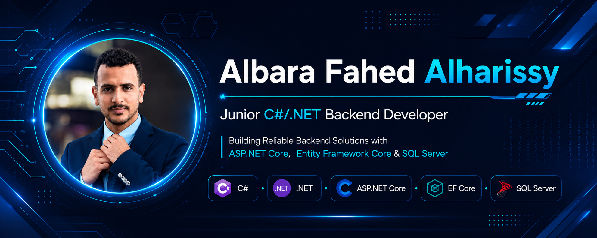

  

<h1 align="center">Hi there 👋 I'm Albara Fahed Alharissy</h1>

<h3 align="center">
Junior C#/.NET Backend Developer
</h3>

Building reliable backend solutions using <strong>ASP.NET Core</strong>, <strong>Entity Framework Core</strong>, and <strong>SQL Server</strong>.

---

# 🚀 About Me

I'm **Albara Fahed Alharissy**, a 4th-year Information Technology student and Junior **C#/.NET Backend Developer** passionate about designing clean, scalable, and maintainable backend systems.

My journey started with desktop application development using **C# WinForms**, where I built several business management systems following **3-Tier Architecture**, **SOLID Principles**, and **SQL Server** best practices.

Today, I'm focused on backend development with **ASP.NET Core**, **Entity Framework Core**, **REST APIs**, and clean software architecture while continuously improving my software engineering skills.

---

# 💻 Tech Stack

### Backend

- C#
- .NET
- ASP.NET Core Web API
- Entity Framework Core
- LINQ
- REST APIs

---

### Database

- SQL Server
- T-SQL
- Database Design

---

### Software Engineering

- Object-Oriented Programming (OOP)
- SOLID Principles
- Clean Architecture
- 3-Tier Architecture
- N-Tier Architecture

---

### Tools

- Visual Studio
- Git
- GitHub
- SQL Server Management Studio
- Postman

---

# 📂 Featured Projects

## 🚗 Drivers & Vehicle Licensing Department (DVLD)

A complete desktop management system developed using:

- C#
- WinForms
- SQL Server
- ADO.NET
- 3-Tier Architecture

**Highlights**

- Driver Management
- License Management
- Local & International Licenses
- Testing Workflow
- User Management
- Application Management
###  Repository:
🔗 https://github.com/Albarafahed/DVLD-Windows-Form-CSharp

---

## 🏥 Clinic Management System

A desktop application for managing clinic operations.

Technologies:

- C#
- SQL Server
- ADO.NET
- 3-Tier Architecture

Features:

- Patients
- Doctors
- Appointments
- Visits
- Pharmacy
- Cashier
- Medical Services

---

## 🏠 Real Estate Management System

Property management system built with:

- C#
- SQL Server
- ADO.NET
- N-Tier Architecture

---

## 📇 Contacts Management System

Desktop CRUD application demonstrating:

- SQL Server
- ADO.NET
- WinForms
- Layered Architecture

---

## 🍕 Pizza Ordering Management System

Desktop ordering system built with:

- C#
- WinForms
- JSON Persistence
- Layered Architecture

---

# 📖 Currently Learning

- Advanced ASP.NET Core
- Entity Framework Core
- Authentication & Authorization
- Clean Architecture
- Design Patterns
- Docker
- Unit Testing

---

# 📊 GitHub Statistics

---

# 📈 GitHub Activity

---

# 🌐 Portfolio

🔗 **Website**

https://albaradev.netlify.app/

---

# 🤝 Let's Connect

---

> *"Building reliable backend solutions, one project at a time."*

